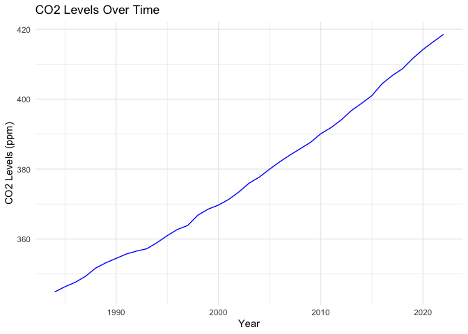
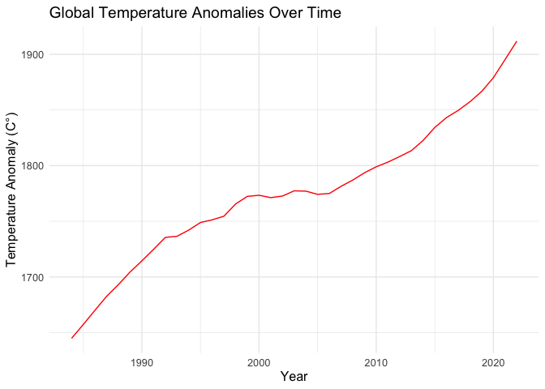
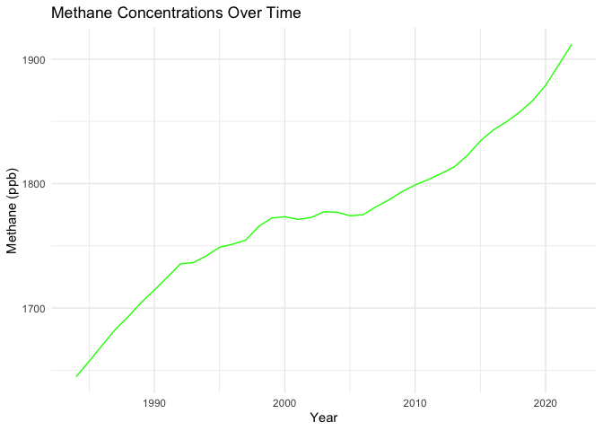
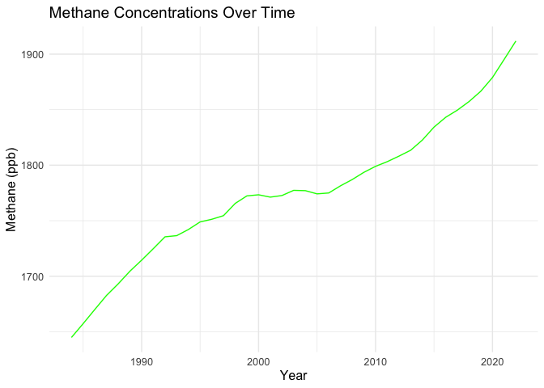
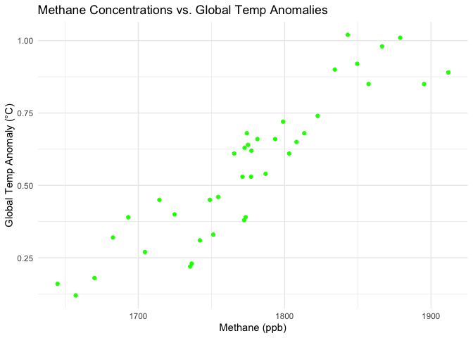

Global Temperature Trends in a Warming World
================
Samuel Meads
(17 April, 2024)

- [Introduction](#introduction)
- [Methods](#methods)
  - [Research Question](#research-question)
    - [Null Hypotheses](#null-hypotheses)
    - [Alternative Hypotheses](#alternative-hypotheses)
  - [Data Analyses](#data-analyses)
    - [Data](#data)
    - [Descriptive Statistics](#descriptive-statistics)
    - [Exploratory Data Analysis](#exploratory-data-analysis)
    - [Time Series Analysis](#time-series-analysis)
    - [Correlation and Causation
      Analysis](#correlation-and-causation-analysis)
    - [Regression Analysis](#regression-analysis)
    - [Casual Inference](#casual-inference)
    - [Model Evaluation](#model-evaluation)
    - [Statistical Testing](#statistical-testing)
    - [Sensitivity and Scenario
      Analysis](#sensitivity-and-scenario-analysis)
- [Results](#results)
- [Conclusion](#conclusion)
- [References](#references)
  - [Articles](#articles)
  - [Data](#data-1)
  - [Pictures](#pictures)


``` r
# Import Libraries
library(tidyverse)
```

    ## ── Attaching core tidyverse packages ──────────────────────── tidyverse 2.0.0 ──
    ## ✔ dplyr     1.1.4     ✔ readr     2.1.5
    ## ✔ forcats   1.0.0     ✔ stringr   1.5.1
    ## ✔ ggplot2   3.4.4     ✔ tibble    3.2.1
    ## ✔ lubridate 1.9.3     ✔ tidyr     1.3.1
    ## ✔ purrr     1.0.2     
    ## ── Conflicts ────────────────────────────────────────── tidyverse_conflicts() ──
    ## ✖ dplyr::filter() masks stats::filter()
    ## ✖ dplyr::lag()    masks stats::lag()
    ## ℹ Use the conflicted package (<http://conflicted.r-lib.org/>) to force all conflicts to become errors

``` r
library(dplyr)
library(knitr)
library(ggplot2)
library("stringr")
library(tidyr)
```

# Introduction

The relationship between the escalating concentrations of greenhouse
gases, specifically carbon dioxide (CO₂) and methane (CH₄), and the
increases in global average temperatures support contemporary
understanding of climate dynamics. This connection not only highlights
the anthropogenic impacts on climate change but also serves as a
critical point for scientific questions aimed at explaining the effects
and potential mitigation strategies for global warming.

Historical and modern scientific efforts have greatly contributed to the
understanding of this relationship. Eunice Foote and, later in the 19th
century, John Tyndall, with their pioneering experiments, both proved
the heat-trapping characteristics of CO₂, as part of the basic knowledge
toward the greenhouse effect, which is necessary for modern-day climatic
science (Armstrong et al., 2018). In the 20th century, scientists,
including Mann et al. (1998), further attempted to provide an
explanation for the dominant role of the gases in recent climate
variability and to confirm the continual impact that had already been
observed in earlier research by using paleoclimatic information to link
changes in greenhouse gas concentrations with large-scale temperature
patterns. The most recent studies, for instance, Hansen et al. (2006)
and Mann et al. (1998), have not only upheld the early findings with
great analysis but have continued to argue out how these gases influence
modern climatic patterns. Some of these include changes in SSTs and
their link to key climate events such as the El Niño. His work, through
the documentary, indeed underscores near effects of these gases and
points out to the constant increase in the temperatures around the
world, which is in line with past predictions and models that sought to
establish the trajectory of climate change.

They increasingly report that the increase of world temperatures is very
much related to rising sea levels—one of those things they are seeing
more often in climate studies of recent years. Mitchell (1989) pointed
out that the enhanced greenhouse gas concentrations have warmed not only
the atmosphere but have also contributed to its thermal expansion,
melting ice caps, which have emerged as major factors for the increased
observed rise in sea levels over the past century.

Building on these foundational experiments and studies, the present
research aims to delve deeper into the correlations and causal
relationships between the increases in specific greenhouse gases with
global temperature trends. Using context from these studies and modern
technological and methodological advances, this piece of work
contributes to having a more cohesive understanding of the mechanisms
involved in climate change by potentially confirming or challenging past
findings.

# Methods

## Research Question

My hypothesis is as follows: increases in atmospheric carbon dioxide and
methane concentrations are significantly correlated with rises in global
average temperature.

### Null Hypotheses

### Alternative Hypotheses

## Data Analyses

Since I am interested in the relationships between

### Data

Data from NASA

``` r
# Import data
co2_data <- read.csv('/Users/sm/Desktop/DataScience/APY313_S24/APY313_DataPractical_Final/Data/CarbonDioxide.csv')
methane_data <- read.csv('/Users/sm/Desktop/DataScience/APY313_S24/APY313_DataPractical_Final/Data/Methane.csv')
globtemp_data <- read.csv('/Users/sm/Desktop/DataScience/APY313_S24/APY313_DataPractical_Final/Data/GlobalTemp.csv')
sealevel_data <- read.csv('/Users/sm/Desktop/DataScience/APY313_S24/APY313_DataPractical_Final/Data/SeaLevel.csv')
```

``` r
head(co2_data)
```

    ##   Year Month Decimal.Date Monthly.Average De.seasonalized X.Days St.Dev
    ## 1 1958     3     1958.203          315.70          314.43     -1  -9.99
    ## 2 1958     4     1958.288          317.45          315.16     -1  -9.99
    ## 3 1958     5     1958.370          317.51          314.71     -1  -9.99
    ## 4 1958     6     1958.455          317.24          315.14     -1  -9.99
    ## 5 1958     7     1958.537          315.86          315.18     -1  -9.99
    ## 6 1958     8     1958.622          314.93          316.18     -1  -9.99
    ##   Unc..of.Mon.Mean
    ## 1            -0.99
    ## 2            -0.99
    ## 3            -0.99
    ## 4            -0.99
    ## 5            -0.99
    ## 6            -0.99

``` r
head(methane_data)
```

    ##   Year    Mean Uncertainty
    ## 1 1984 1644.85        0.67
    ## 2 1985 1657.29        0.59
    ## 3 1986 1670.09        0.74
    ## 4 1987 1682.70        0.49
    ## 5 1988 1693.16        0.67
    ## 6 1989 1704.53        0.55

``` r
head(globtemp_data)
```

    ##   Year No_Smoothing Lowess.5.
    ## 1 1880        -0.16     -0.09
    ## 2 1881        -0.08     -0.13
    ## 3 1882        -0.11     -0.16
    ## 4 1883        -0.17     -0.20
    ## 5 1884        -0.28     -0.24
    ## 6 1885        -0.33     -0.26

``` r
head(sealevel_data)
```

    ##   Altimeter.Type Merged.File.Cycle.. Year...Fraction.of.Year
    ## 1            999                  20                1993.256
    ## 2            999                  31                1993.555
    ## 3            999                  41                1993.827
    ## 4            999                  55                1994.207
    ## 5            999                  65                1994.478
    ## 6            999                  79                1994.859
    ##   Number.of.Observations Number.of.Weighted.Observations
    ## 1                 450755                        327812.6
    ## 2                 248043                        185244.8
    ## 3                 448130                        332835.0
    ## 4                 370024                        269158.4
    ## 5                 457711                        337475.1
    ## 6                 391912                        291774.4
    ##   GMSL.Variation..No.GIA...mm. Std.Dev.GMSL..No.GIA...mm.
    ## 1                       -38.21                      95.18
    ## 2                       -34.62                      89.16
    ## 3                       -27.44                      92.86
    ## 4                       -30.85                      89.45
    ## 5                       -33.62                      84.96
    ## 6                       -21.13                     100.25
    ##   Smoothed.GMSL..No.GIA...mm. GMSL.Variation..GIA...mm. Std.Dev.GMSL..GIA...mm.
    ## 1                      -35.85                    -38.15                   95.17
    ## 2                      -32.40                    -34.49                   89.17
    ## 3                      -27.56                    -27.24                   92.87
    ## 4                      -31.38                    -30.55                   89.43
    ## 5                      -33.09                    -33.26                   84.96
    ## 6                      -23.83                    -20.68                  100.28
    ##   Smoothed.GMSL..GIA...mm. Smoothed.GMSL..GIA..No.Seasonal...mm.
    ## 1                   -35.79                                -32.85
    ## 2                   -32.26                                -31.45
    ## 3                   -27.36                                -32.21
    ## 4                   -31.09                                -28.75
    ## 5                   -32.72                                -29.36
    ## 6                   -23.38                                -27.50
    ##   Smoothed.GMSL..No.GIA..No.Seasonal...mm.
    ## 1                                   -32.91
    ## 2                                   -31.58
    ## 3                                   -32.41
    ## 4                                   -29.05
    ## 5                                   -29.73
    ## 6                                   -27.96

### Descriptive Statistics

### Exploratory Data Analysis

### Time Series Analysis

### Correlation and Causation Analysis

### Regression Analysis

### Casual Inference

### Model Evaluation

### Statistical Testing

### Sensitivity and Scenario Analysis

``` r
co2_annual <- co2_data %>%
  filter(Year >= 1984) %>%
  group_by(Year) %>%
  summarize(AnnualAverageCO2 = mean(Monthly.Average, na.rm = TRUE))

methane_annual <- methane_data %>%
  group_by(Year) %>%
  summarize(AnnualAverageMethane = mean(Mean, na.rm = TRUE))

temp_annual <- globtemp_data %>%
  filter(Year >= 1984) %>%
  select(Year, No_Smoothing) %>%
  rename(AnnualAverageTemp = No_Smoothing)
```

``` r
combined_data <- merge(co2_annual, methane_annual, by = "Year")
combined_data <- merge(combined_data, temp_annual, by = "Year")
colnames(combined_data)
```

    ## [1] "Year"                 "AnnualAverageCO2"     "AnnualAverageMethane"
    ## [4] "AnnualAverageTemp"

``` r
# Time series plot for CO2 Levels
ggplot(data = combined_data, aes(x = Year, y = AnnualAverageCO2)) +
  geom_line(color = "blue") +
  ggtitle("CO2 Levels Over Time") +
  xlab("Year") +
  ylab("CO2 Levels (ppm)") +
  theme_minimal()
```

<!-- -->

``` r
# Time series plot for Global Temperature Anomalies
ggplot(data = combined_data, aes(x = Year, y = AnnualAverageTemp)) +
  geom_line(color = "red") +
  ggtitle("Global Temperature Anomalies Over Time") +
  xlab("Year") +
  ylab("Temperature Anomaly (°C)") +
  theme_minimal()
```

<!-- -->

``` r
# Time series plot for Methane Concentrations
ggplot(data = combined_data, aes(x = Year, y = AnnualAverageMethane)) +
  geom_line(color = "green") +
  ggtitle("Methane Concentrations Over Time") +
  xlab("Year") +
  ylab("Methane (ppb)") +
  theme_minimal()
```

<!-- -->

``` r
# Scatter plot for CO2 Levels vs. Global Temperature Anomalies
ggplot(data = combined_data, aes(x = AnnualAverageCO2, y = AnnualAverageTemp)) +
  geom_point(color = "blue") +
  ggtitle("CO2 Levels vs. Global Temp Anomalies") +
  xlab("CO2 Levels (ppm)") +
  ylab("Global Temp Anomaly (°C)") +
  theme_minimal()
```

<!-- -->

``` r
# Scatter plot for Methane Concentrations vs. Global Temperature Anomalies
ggplot(data = combined_data, aes(x = AnnualAverageMethane, y = AnnualAverageTemp)) +
  geom_point(color = "green") +
  ggtitle("Methane Concentrations vs. Global Temp Anomalies") +
  xlab("Methane (ppb)") +
  ylab("Global Temp Anomaly (°C)") +
  theme_minimal()
```

<!-- -->

``` r
# Linear regression of Global Temp Anomaly on CO2 Levels
lm_CO2 = lm(AnnualAverageTemp ~ AnnualAverageCO2, data = combined_data)
summary(lm_CO2)
```

    ## 
    ## Call:
    ## lm(formula = AnnualAverageTemp ~ AnnualAverageCO2, data = combined_data)
    ## 
    ## Residuals:
    ##       Min        1Q    Median        3Q       Max 
    ## -0.120598 -0.083232 -0.006189  0.064371  0.176377 
    ## 
    ## Coefficients:
    ##                    Estimate Std. Error t value Pr(>|t|)    
    ## (Intercept)      -3.4352434  0.2440148  -14.08   <2e-16 ***
    ## AnnualAverageCO2  0.0105805  0.0006446   16.41   <2e-16 ***
    ## ---
    ## Signif. codes:  0 '***' 0.001 '**' 0.01 '*' 0.05 '.' 0.1 ' ' 1
    ## 
    ## Residual standard error: 0.08811 on 37 degrees of freedom
    ## Multiple R-squared:  0.8793, Adjusted R-squared:  0.876 
    ## F-statistic: 269.5 on 1 and 37 DF,  p-value: < 2.2e-16

``` r
# Linear regression of Global Temp Anomaly on Methane levels
lm_Methane = lm(AnnualAverageTemp ~ AnnualAverageMethane, data = combined_data)
summary(lm_Methane)
```

    ## 
    ## Call:
    ## lm(formula = AnnualAverageTemp ~ AnnualAverageMethane, data = combined_data)
    ## 
    ## Residuals:
    ##       Min        1Q    Median        3Q       Max 
    ## -0.198303 -0.044107 -0.003874  0.079281  0.215798 
    ## 
    ## Coefficients:
    ##                        Estimate Std. Error t value Pr(>|t|)    
    ## (Intercept)          -5.8035495  0.4738013  -12.25 1.38e-14 ***
    ## AnnualAverageMethane  0.0035851  0.0002666   13.45 8.13e-16 ***
    ## ---
    ## Signif. codes:  0 '***' 0.001 '**' 0.01 '*' 0.05 '.' 0.1 ' ' 1
    ## 
    ## Residual standard error: 0.1045 on 37 degrees of freedom
    ## Multiple R-squared:  0.8301, Adjusted R-squared:  0.8255 
    ## F-statistic: 180.8 on 1 and 37 DF,  p-value: 8.131e-16

# Results

# Conclusion

# References

## Articles

Armstrong, Anne K., et al. CLIMATE CHANGE SCIENCE: The Facts.
Communicating Climate Change: A Guide for Educators, Cornell University
Press, 2018, pp. 7-20. JSTOR,
<http://www.jstor.org/stable/10.7591/j.ctv941wjn.5>.

Hansen, James, et al. “Global Temperature Change.” Proceedings of the
National Academy of Sciences, vol. 103, no. 39, 26 Sept. 2006,
pp. 14288–14293. PNAS, www.pnas.org/cgi/doi/10.1073/pnas.0606291103.

Mann, Michael E., Raymond S. Bradley, and Malcolm K. Hughes.
“Global-Scale Temperature Patterns and Climate Forcing Over the Past Six
Centuries.” Nature, vol. 392, 23 Apr. 1998, pp. 779-787,
<https://www.nature.com/articles/33859>

Mitchell, J. F. B. “The ‘Greenhouse’ Effect and Climate Change.”
Rev. Geophys., vol. 27, no. 1, 1989, pp. 115-139,
<doi:10.1029/RG027i001p00115>.

## Data

National Aeronautics and Space Administration. “Climate Change: Vital
Signs of the Planet.” NASA, n.d.,
<https://science.nasa.gov/climate-change/>.

## Pictures

“Electric Towers During Golden Hour.” Pexels, uploaded by Pixabay,
<https://www.pexels.com/photo/electric-towers-during-golden-hour-221012/>.
